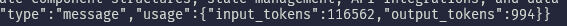

yikes

> [!IMPORTANT]
> The below docs are generated by claude and serve as a benchmark for the capabilities.

# Introduction

This code repository contains a Python project that utilizes the Anthropic API to generate technical documentation for a given code repository. The project aims to automate the process of creating comprehensive documentation by leveraging the power of the Claude AI model.

The core functionality of the project revolves around extracting relevant code files from a local repository, preprocessing the code, and sending it to the Claude AI model for generating detailed technical documentation. The generated documentation covers various aspects of the codebase, including an overview, development environment setup, repository structure, key points of complexity, installation instructions, and a getting started guide.

# Codebase Overview

The codebase consists of two main Python files:

1. `api.py`: This file contains the main logic for interacting with the Anthropic API and generating the technical documentation. It includes functions for sending requests to the Claude AI model, reading the repository content from a text file, and generating the documentation based on the provided system prompt.

2. `extract_repo.py`: This file is responsible for extracting relevant code files from a local repository directory. It walks through the directory, identifies desired file types (JavaScript, TypeScript, Prisma, Python), and filters out less useful files and directories. The extracted code files are then written to a text file for further processing.

The codebase follows a modular structure, with each file having specific responsibilities. The `api.py` file handles the API integration and documentation generation, while the `extract_repo.py` file focuses on extracting and preprocessing the code files from the local repository.

# Development Environment Setup

To set up the development environment for this project, follow these steps:

1. Install Python (version 3.6 or above) on your system.
2. Clone the repository from the version control system (e.g., Git).
3. Create a virtual environment using the following command:
   ```
   python -m venv myenv
   ```
4. Activate the virtual environment:
   - For Windows:
     ```
     myenv\Scripts\activate
     ```
   - For macOS and Linux:
     ```
     source myenv/bin/activate
     ```
5. Install the required dependencies by running:
   ```
   pip install -r requirements.txt
   ```
6. Set up the necessary API keys and environment variables:
   - Create a `.env` file in the project root directory.
   - Add the following line to the `.env` file:
     ```
     ANTHROPIC_API_KEY=your_api_key_here
     ```
   - Replace `your_api_key_here` with your actual Anthropic API key.

# Code Repository Structure

The code repository has the following structure:

```
claude/
│
├── api.py
├── extract_repo.py
└── requirements.txt
```

- `api.py`: Contains the main logic for interacting with the Anthropic API and generating documentation.
- `extract_repo.py`: Handles the extraction and preprocessing of code files from a local repository.
- `requirements.txt`: Lists the required Python dependencies for the project.

# Key Points of Complexity

1. API Integration with Anthropic:

   - The code establishes a connection with the Anthropic API using the provided API key.
   - It sends requests to the Claude AI model to generate technical documentation based on the provided code repository.
   - The response from the API is processed and saved as a JSON file and a Markdown file.

2. Repository Extraction and Preprocessing:
   - The code walks through a local repository directory and identifies relevant code files based on file extensions (JavaScript, TypeScript, Prisma, Python).
   - It applies various filters to exclude less useful files and directories, such as tests, examples, and hidden directories.
   - The extracted code files are preprocessed to remove comments and docstrings (for Python files) and written to a text file for further processing.

# Installation and Setup

To install and set up the project, follow these steps:

1. Clone the repository from the version control system (e.g., Git):
   ```
   git clone https://github.com/your-username/claude.git
   ```
2. Navigate to the project directory:
   ```
   cd claude
   ```
3. Create a virtual environment and activate it (refer to the Development Environment Setup section for detailed instructions).
4. Install the required dependencies:
   ```
   pip install -r requirements.txt
   ```
5. Set up the Anthropic API key in the `.env` file (refer to the Development Environment Setup section for detailed instructions).

# Getting Started

To generate technical documentation for a code repository using this project, follow these steps:

1. Ensure that you have completed the installation and setup process mentioned above.
2. Prepare the local repository directory that you want to generate documentation for.
3. Run the `extract_repo.py` script, providing the path to the local repository directory as an argument:
   ```
   python extract_repo.py /path/to/local/repository
   ```
   This script will extract the relevant code files from the repository and save them to a text file.
4. Run the `api.py` script, providing the path to the generated text file as an argument:
   ```
   python api.py repository_name_code.txt
   ```
   Replace `repository_name_code.txt` with the actual name of the generated text file.
5. The script will prompt you to confirm the input token size. Enter 'Y' to proceed or 'N' to exit.
6. The script will send a request to the Anthropic API and generate the technical documentation based on the provided code repository.
7. The generated documentation will be saved as a JSON file (`repository_name-response.json`) and a Markdown file (`repository_name-docs.md`) in the project directory.

You can now review the generated documentation in the Markdown file to understand the structure, setup, and key points of the code repository.

Note: Make sure to handle the generated files (JSON and Markdown) appropriately, such as storing them in a suitable location or integrating them into your documentation system.
